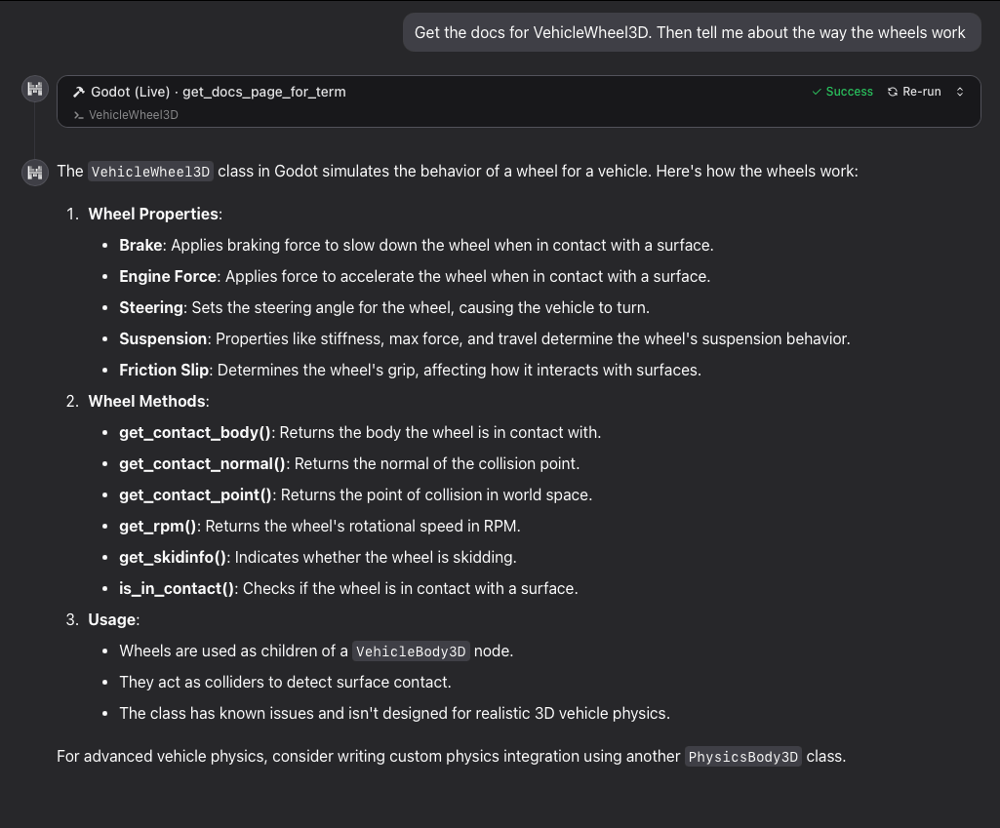

# Godot Docs MCP



*This project is [hosted on Cloudflare using their Agents framework](https://developers.cloudflare.com/agents/)*

Look up documentation in Godot using fuzz search. Supports `stable`, `latest`, `4.5`, `4.4`, and `4.3` versions. The default version is "stable".

## Tools

**search_docs** `(searchTerm: string, version: "stable" | "latest" | "4.5" | "4.4" | "4.3" = "stable")`

> Search the Godot docs by term. Will return URLs to the documentation for each matching term. The resulting URLs will need to have their page content fetched to see the documentation.

**get_docs_page_for_term** `(searchTerm: string, version: "stable" | "latest" | "4.5" | "4.4" | "4.3" = "stable")`

> Get the Godot docs content by term. Will return the full documentation page for the first matching result.

## Configure the MCP server

To use the hosted HTTP server:

```json
{
  "mcpServers": {
    "godot": {
      "type": "http",
      "url": "https://godot-docs-mcp.j2d.workers.dev/mcp"
    }
  }
}
```

Or, to connect to the MCP server using a `stdio` server:

```json
{
  "mcpServers": {
    "godot": {
      "command": "npx",
      "args": [
        "mcp-remote",
        "https://godot-docs-mcp.j2d.workers.dev/mcp"
      ]
    }
  }
}
```

### How this works

The docs site uses a frontend search tool to handle the docs search. There is a file called `searchindex.js` in the docs site that contains an index of all the pages (URLs and titles, not content) on the site.

This project takes advantage of that in the following ways:

- downloads each of those `searchindex.js` files for each version of the docs
- converts the `searchindex.js` to a `searchindex.js.json` that is just json we need
- indexes that new json using [lucaong/minisearch](https://github.com/lucaong/minisearch)
- when a docs page is requested, the URL for the page is converted from HTML to markdown

## Local development

### MCP server

```sh
npm install
npm run dev
```

Then, set up your tool:

```json
{
  "mcpServers": {
    "godot": {
      "command": "npx",
      "args": [
        "mcp-remote",
        "http://localhost:8787/mcp"
      ]
    }
  }
}
```

To debug the server, you can use [this browser tool](https://github.com/modelcontextprotocol/inspector):

```sh
# in another tab
npx @modelcontextprotocol/inspector
```

Then open http://localhost:6274/#tools

### Generating the docs

```sh
# create the folders
echo "stable,latest,4.5,4.4,4.3" | string split "," | xargs -I {} mkdir -p "src/indexes/{}"
# download the files
echo "stable,latest,4.5,4.4,4.3" | string split "," | xargs -I {} curl -o "src/indexes/{}/searchindex.js" "https://docs.godotengine.org/en/{}/searchindex.js"
# convert the .js to a .json
lsd src/indexes/*/searchindex.js | xargs -n1 fish -c 'cat "$argv" | sd "Search.setIndex\(" "" | sed \'$ s/.$//\' | jq \'.docnames | to_entries | map({id: .key, name: .value, category: .value | split("/") | first, url: "/\\(.value).html"})\' > "$argv.json"'
```